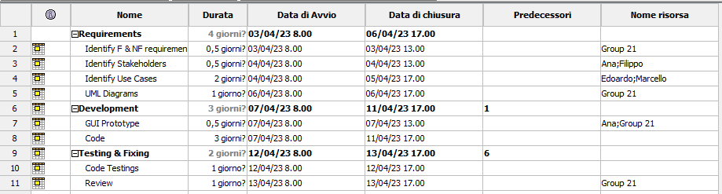
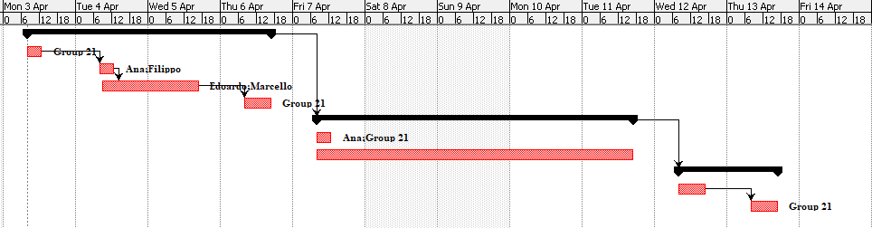

# Project Estimation - CURRENT
Date: 14/04/2023

Version: 1.0

# Estimation approach
Consider the EZWallet  project in CURRENT version (as received by the teachers), assume that you are going to develop the project INDEPENDENT of the deadlines of the course
# Estimate by size
### 
|             | Estimate                        |             
| ----------- | ------------------------------- |  
| NC =  Estimated number of classes to be developed   |               12              |             
|  A = Estimated average size per class, in LOC       |                75            | 
| S = Estimated size of project, in LOC (= NC * A) | 900 |
| E = Estimated effort, in person hours (here use productivity 10 LOC per person hour)  |                   90                   |   
| C = Estimated cost, in euro (here use 1 person hour cost = 30 euro) | 2700 | 
| Estimated calendar time, in calendar weeks (Assume team of 4 people, 8 hours per day, 5 days per week ) |            3 days        |               

<!-- 12 package .js -->

# Estimate by product decomposition
### 
|         component name    | Estimated effort (person hours)   |             
| ----------- | ------------------------------- | 
|requirement document    | 20 |
| GUI prototype |5|
|design document |8|
|code | 60 |
| unit tests |15|
| api tests |15|
| management documents  | 5 |

<!-- Estimated effort = Code + Unit tests + Api Tests .js -->

# Estimate by activity decomposition
<!-- ### 
|         Activity name    | Estimated effort (person hours)   |             
| ----------- | ------------------------------- | 
| | | -->
###

# Summary

Report here the results of the three estimation approaches. The  estimates may differ. Discuss here the possible reasons for the difference

(Assuming 8 hours per day!)

|             | Estimated effort         (Person hours)               |   Estimated duration (Calendar days)|  
| ----------- | ------------------------------- | ---------------|
| estimate by size | 90 | 3 |
| estimate by product decomposition |128 | 4 |
| estimate by activity decomposition | 98 | 3 |

Differences can be caused by the fact that not all the work can be parallelized. Only the *activity decomposition* estimation includes this factor that is the reason why it differs from the other two estimations.
