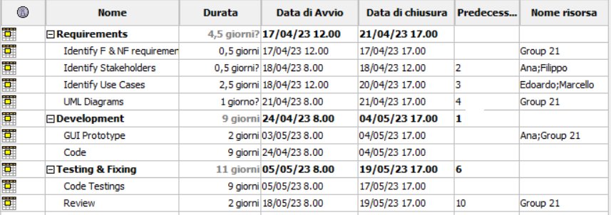
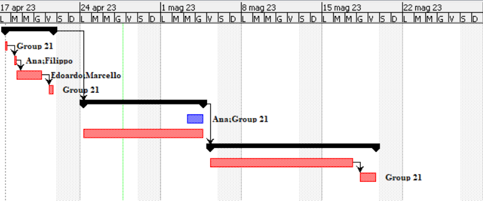

# Project Estimation - FUTURE
Date: 24/04

Version: 1.1

# Estimation approach
Consider the EZWallet  project in FUTURE version (as proposed by the team), assume that you are going to develop the project INDEPENDENT of the deadlines of the course

# Estimate by size
###
|             | Estimate                        |            
| ----------- | ------------------------------- |  
| #modules =  Estimated number of module to be developed   | 8+3 |                      
|  A = Estimated average size per module, in LOC       |  140  |                        
| S = Estimated size of project, in LOC (= #modules * A) | 1540 |
| E = Estimated effort, in person hours (here use productivity 10 LOC per person hour)  |      154     |  
| C = Estimated cost, in euro (here use 1 person hour cost = 30 euro)| 4620   |
| Estimated calendar time, in calendar weeks (Assume team of 4 people, 8 hours per day, 5 days per week ) |  1.5 week |    
             

# Estimate by product decomposition
###
|         component name    | Estimated effort (person hours)   |            
| ----------- | ------------------------------- |
|requirement document    | 35 |
| GUI prototype |15 |
|design document |40|
|code | 79 |
| unit tests |70|
| api tests |5|
| management documents  |5|

<!-- </Estimated effort = Code + Unit tests + Api Tests .js> -->

# Estimate by activity decomposition
<!-- ### 
|         Activity name    | Estimated effort (person hours)   |             
| ----------- | ------------------------------- | 
| | | -->
###
<!-- Insert here Gantt chart with above activities -->

# Summary

Report here the results of the three estimation approaches. The  estimates may differ. Discuss here the possible reasons for the difference

|             | Estimated effort                        |   Estimated duration |          
| ----------- | ------------------------------- | ---------------|
| estimate by size | 154 | 5 |
| estimate by product decomposition | 249 | 8 |
| estimate by activity decomposition | 254 | 8 |

Differences can be caused by the fact that not all the work can be parallelized. Only the *activity decomposition* estimation includes this factor that is the reason why it differs from the other two estimations.

In this case, it is also possible to notice that in the estimation by product decomposition it looks like someway this considerations are done.
