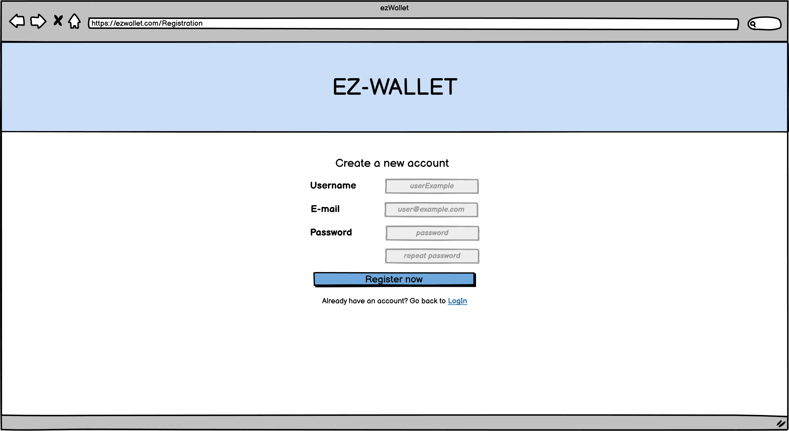
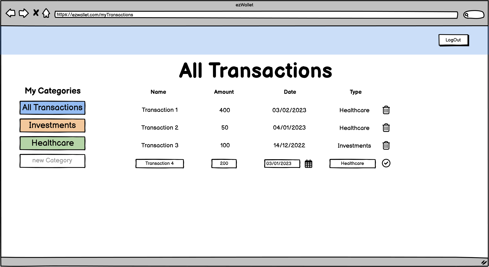
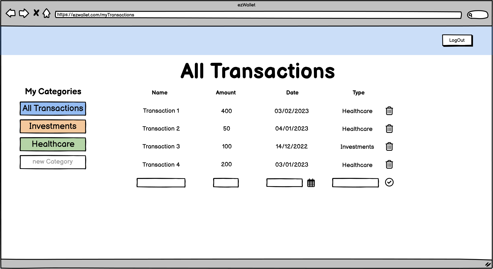
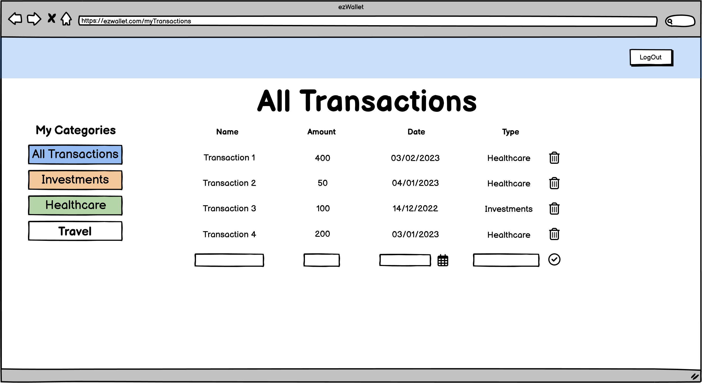
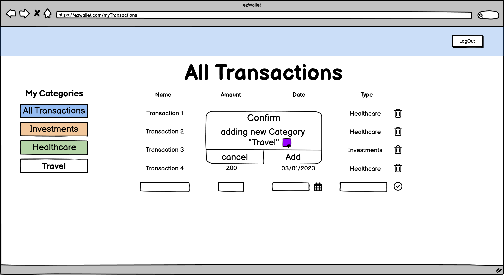
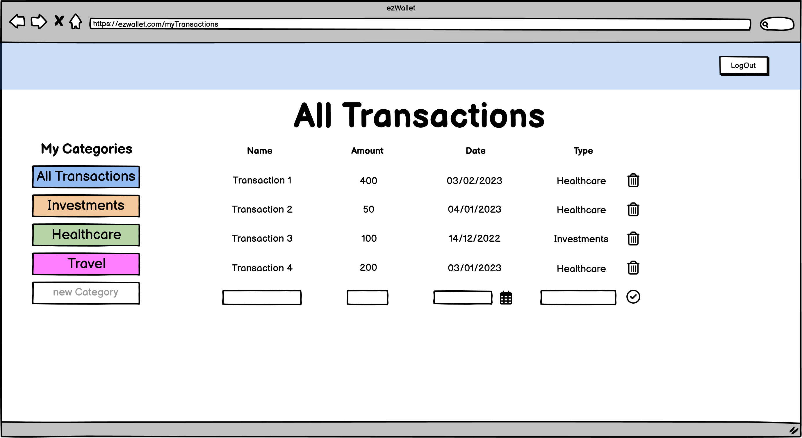

# Graphical User Interface Prototype  - CURRENT

Authors: group 21

Date: 07/04

Version: 1.0

Login: user access to EZWallet with her credentials or click to link to redirect to the registration page.

Registration page: where the user can enter his data and sign up for EZWallet.

Home page of EZWallet where the user can see all transactions, add a new transaction by inserting the required data, filter by category (to the left) and add a new category to the list by writing in the text field under all categories list.

The user inserts the required data to add a new transaction.

The new transaction is pushed.

The user writes the name of the new category she wants to create.

A popup to pick the colour labelling for the category is shown and asks for confirmation.

The new category is pushed.

<!-- \<Report here the GUI that you propose for EZWallet in CURRENT form, as received by teachers. You are free to organize it as you prefer. A suggested presentation matches the Use cases and scenarios defined in the Requirement document. The GUI can be shown as a sequence of graphical files (jpg, png)  > -->

