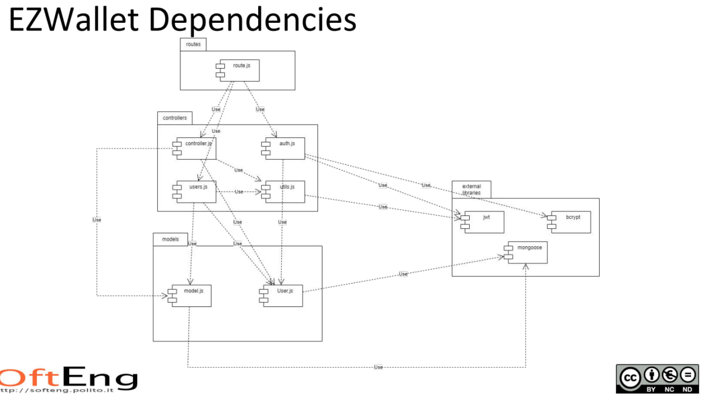

# Test Report

<The goal of this document is to explain how the application was tested, detailing how the test cases were defined and what they cover>

WB# Contents

- [Dependency graph](#dependency-graph)

- [Integration approach](#integration-approach)

- [Tests](#tests)

- [Coverage](#Coverage)

# Dependency graph 

     <report the here the dependency graph of EzWallet>

> No NEW dependencies have been added

     
# Integration approach

    <Write here the integration sequence you adopted, in general terms (top down, bottom up, mixed) and as sequence
    (ex: step1: unit A, step 2: unit A+B, step 3: unit A+B+C, etc)> 
    <Some steps may  correspond to unit testing (ex step1 in ex above)>
    <One step will  correspond to API testing, or testing unit route.js>

    The integration sequence followed was the mixed one since the units were developed following the integration sequence order, in this way:

    - For some cases Bottom up was applied, following the sequence: 
            step 1: function A
            step 2: function B
            step 3: testing function A + B as if they were a single unit.
            step 4: test all. If defects are found, they will come from the interaction between fucntions.

    - For some other cases, Top down was applied, following the sequence:
            step 1: function A
            step 2: interaction function A-B and A-C
            step 3: testing function D, and interaction to previous functions.
            
# Tests

   <in the table below list the test cases defined For each test report the object tested, the test level (API, integration, unit) and the technique used to define the test case  (BB/ eq partitioning, BB/ boundary/ boundary, WB/ statement coverage, etc)>   <split the table if needed>

| Test case name | Object(s) tested | Test level | Technique used |
|----------------|-----------------|------------|----------------|
|'POST /api/register'|'should return 400 if username, email or password are missing'|integration|BB/ boundary|
|'POST /api/register'|'should return 400 if username, email or password are empty strings'|integration|BB/ boundary|
|'POST /api/register'|'should return 400 if email is not in a valid format'|integration|BB/ boundary|
|'POST /api/register'|'should return 400 if username already exists'|integration|BB/ boundary|
|'POST /api/register'|'should return 400 when email format is invalid'|integration|BB/ boundary|
|'POST /api/register'|'should return 400 when username is already in use'|integration|BB/ boundary|
|'POST /api/register'|'should return 400 if email already exists'|integration|BB/ boundary|
|'POST /api/register'|'should return 200 and confirm user was added successfully'|integration|BB/ boundary
|'registerAdmin'|'should register a new admin user'|integration|BB/ boundary|
|'registerAdmin'|should return 400 when missing fields|integration|BB/ boundary|
|'registerAdmin'|'should return 400 when fields are empty strings'|integration|BB/ boundary|
|'registerAdmin'|'Empty fields are not allowed'|integration|BB/ boundary|
|'registerAdmin'|'should return 400 when email format is invalid'|integration|BB/ boundary|
|'registerAdmin'|'should return 400 when username is already in use'|integration|BB/ boundary|
|'registerAdmin'|'should return 400 when email is already in use'|integration|BB/ boundary|
|'registerAdmin'|should return 500 if database operation fails|integration|BB/ boundary|
|'POST /api/login'|'should return 400 if email or password are missing'|integration|BB/ boundary|
|'POST /api/login'|'should return 400 if email or password are empty strings'|integration|BB/ boundary|
|'POST /api/login'|'should return 400 if email is not in a valid format''|integration|BB/ boundary|
|'POST /api/login'|''should return 400 if the user does not exist'|integration|BB/ boundary|
|'POST /api/login'|'should return 400 if the supplied password does not match with the one in the database'|integration|BB/ boundary|
|'POST /api/login'|'should return 200 and create an accessToken and refreshToken'|integration|BB/ boundary|
|'POST /api/logout'|'should return 400 if no refresh token is provided'|integration|BB/ boundary|
|'POST /api/logout'|'should return 400 if refresh token does not represent a user in the database'|integration|BB/ boundary|
|'POST /api/logout'|should return 200 and confirm user was logged out successfully'|integration|BB/ boundary|
|'register'|'should register a new user successfully'|unit|WB/ statement coverage|
|'register'|'should return 400 error if the request body does not contain all the necessary attributes'|unit|WB/ statement coverage|
|'register'|'should return 400 error if at least one of the parameters in the request body is an empty string'|unit|WB/ statement coverage|
|'register'|'should return 400 error if the email in the request body is not in a valid email format'|unit|WB/ statement coverage|
|'register'|'should return 400 error if the username in the request body identifies an already existing user'|unit|WB/ statement coverage|
|'register'|'should return 400 error if the email in the request body identifies an already existing user'|unit|WB/ statement coverage|
|'register'|'should return 500 error if there is a server error'|unit|WB/ statement coverage|
|'registerAdmin '|'should register a new admin user successfully'|unit|WB/ statement coverage|
|'registerAdmin '|'should return 400 error if the request body does not contain all the necessary attributes'|unit|WB/ statement coverage|
|'registerAdmin '|''should return 400 error if at least one of the parameters in the request body is an empty string'|unit|WB/ statement coverage|
|'registerAdmin '|'should return 400 error if the email in the request body is not in a valid email format'|unit|WB/ statement coverage|
|'registerAdmin '|'should return 400 error if the username in the request body identifies an already existing user'|unit|WB/ statement coverage|
|'registerAdmin '|'should return 400 error if the email in the request body identifies an already existing user'|unit|WB/ statement coverage|
|'registerAdmin '|'should return 500 error if there is a server error'|unit|WB/ statement coverage|
|'login'|'should log in a user successfully'|unit|WB/ statement coverage|
|'login'|'should return 400 error if the request body does not contain all the necessary attributes'|unit|WB/ statement coverage|
|'login'|'should return 400 error if at least one of the parameters in the request body is an empty string'|unit|WB/ statement coverage|
|'login'|'should return 400 error if the email in the request body is not in a valid email format'|unit|WB/ statement coverage|
|'login'|'should return 400 error if the email in the request body does not identify a user in the database'|unit|WB/ statement coverage|
|'login'|'should return 400 error if the supplied password does not match with the one in the database'|unit|WB/ statement coverage|
|'login'|'should return 500 error if there is a server error'|unit|WB/ statement coverage|
|'logout'|'should logout a user successfully'|unit|WB/ statement coverage|
|'logout'|'should return 400 error if the request does not have a refresh token in the cookies'|unit|WB/ statement coverage|
|'logout'|'should return 400 error if the refresh token in the request\'s cookies does not represent a user in the database'|unit|WB/ statement coverage|
|'logout'|'should return 500 error if there is a server error'|unit|WB/ statement coverage|
|'createCategory'|'createCategory: returns status 200 if admin creates a new category'|Integration|BB/ boundary|
|'createCategory'|'createCategory: returns status 401 if user tries to create a new category'|Integration|BB/ boundary|
|'createCategory'|'createCategory: returns status 400 if some parameters are not provided'|Integration|BB/ boundary|
|'createCategory'|returns status 400 if some parameters are empty'|Integration|BB/ boundary|
|'createCategory'|createCategory: returns status 400 if the type of category passed in the request body represents an already existing category in the database'|Integration|BB/ boundary|
|'updateCategory'|'Returns a message for confirmation and the number of updated transactions'|Integration|BB/ boundary|
|'updateCategory'|'Returns a 400 error if the type of the new category is the same as one that exists already and that category is not the requested one'|Integration|BB/ boundary|
|'updateCategory'|'Returns a 400 error  if at least one of the parameters in the request body is an empty string'|Integration|BB/ boundary|
|'updateCategory'|'Returns a 400 error if the type of category passed as a route parameter does not represent a category in the databas'|Integration|BB/ boundary|
|'updateCategory'|'Returns a 400 error if the request body does not contain all the necessary parameters'|Integration|BB/ boundary|
|'updateCategory'|'Returns a 401 error if called by a user who is not an Admin'|Integration|BB/ boundary|
|'deleteCategory'|'returns status 400 if at least one of the types in the array does not represent a category in the database'|Integration|BB/ boundary|
|'deleteCategory'|'returns status 401 if called by an authenticated user who is not an admin'|Integration|BB/ boundary|
|'getCategories'|'returns status 200 if okay - user'|Integration|BB/ boundary|
|'getCategories'|'getCategories: returns status 200 if okay - admin'|Integration|BB/ boundary|
|'getCategories'|returns status 401 if user is not authenticated'|Integration|BB/ boundary|
|'createTransaction'|'returns status 200 if okay - user'|Integration|BB/ boundary|
|'createTransaction'|'returns status 200 if okay - user - negative'|Integration|BB/ boundary|
|'createTransaction'|'returns status 200 if okay - admin'|Integration|BB/ boundary|
|'createTransaction'|' returns status 400 if the request body does not contain all the necessary attributes'|Integration|BB/ boundary|
|'createTransaction'|'returns status 400 if at least one of the parameters in the request body is an empty string'|Integration|BB/ boundary|
|'createTransaction'|'createTransaction: returns status 400 if the type of category passed in the request body does not represent a category in the database'|Integration|BB/ boundary|
|'createTransaction'|' returns status 400 if the username passed in the request body is not equal to the one passed as a route parameter'|Integration|BB/ boundary|
|'createCategory'|'Should successfully create a Category'|unit|WB/ statement coverage|
|'createCategory'|'Should return 400 error if the body is missing a parameter'|unit|WB/ statement coverage|
|'createCategory'|'Should return 400 if at least one of the parameters in the request body is an empty string'|unit|WB/ statement coverage|
|'createCategory'|'Should return 401 if the User is not an authorized'|unit|WB/ statement coverage|
|'createCategory'|'Should return 400 if a category with the same type already exists'|unit|WB/ statement coverage|
|'createCategory'|'Should return 500 if there is a Server Error'|unit|WB/ statement coverage|
|'updateCategory'|'Invalid color'|unit|WB/ statement coverage|
|'updateCategory'|'Category not found'|unit|WB/ statement coverage|
|'updateCategory'|'Unauthorized user'|unit|WB/ statement coverage|
|'deleteCategory'|'Category does not exist'|unit|WB/ statement coverage|
|'deleteCategory'|'Deletes categories successfully'|unit|WB/ statement coverage|
|'deleteCategory'|'Returns 400 if parameters are not enough'|unit|WB/ statement coverage|
|'deleteCategory'|'Returns 400 if the category doesnt exist'|unit|WB/ statement coverage|
|'deleteCategory'|'Returns 400 if empty string is found in types array'|unit|WB/ statement coverage|
|'getCategories'|'Should return all categories'|unit|WB/ statement coverage|
|'getCategories'|'Should return empty array if there are no categories'|unit|WB/ statement coverage|
|'getCategories'|'Should return 401 if User is not authorized'|unit|WB/ statement coverage|
|'getCategories'|'Should return 500 if there is a Server Error'|unit|WB/ statement coverage|
|'createTransaction'|'Should successfully create a transaction'|unit|WB/ statement coverage|
|'createTransaction'|'Should return 401 if the User is not an authorized'|unit|WB/ statement coverage|
|'createTransaction'|'Should return 400 if some parameters are missing'|unit|WB/ statement coverage|
|'createTransaction'|'Should return 400 if some parameters are empty'|unit|WB/ statement coverage|
|'createTransaction'|'Should return 400 if category does not exist'|unit|WB/ statement coverage|
|'createTransaction'|'Should return 400 if username and URL username mismatch'|unit|WB/ statement coverage|
|'createTransaction'|'Should return 400 if amount is invalid'|unit|WB/ statement coverage|
|'createTransaction'|'Should return 500 if there is a Server Error'|unit|WB/ statement coverage|
|'getAllTransactions'|'Should return transactions data if the User is authorized'|unit|WB/ statement coverage|
|'getAllTransactions'|'Should return 401 if the User is not an authorized'|unit|WB/ statement coverage|
|'getAllTransactions'|'Should return 500 if there is a Server Error'|unit|WB/ statement coverage|
|'getTransactionsByUser'|'Should return all transactions for the specified regular user'|unit|WB/ statement coverage|
|'getTransactionsByUser'|' "Should return 401 if authorized but in the wrong path'|unit|WB/ statement coverage|
|'getTransactionsByUser'|'Should return 400 if the user does not exist'|unit|WB/ statement coverage|
|'getTransactionsByUser'|'Should return filtered transactions based on query parameters'|unit|WB/ statement coverage|
|'getTransactionsByUser'|'Should return 500 if there is a Server Error'|unit|WB/ statement coverage|
|'getTransactionsByUserByCategory'|'Should return transactions for the specified user and category'|unit|WB/ statement coverage|
|'getTransactionsByUser'|'Should return 400 if the user does not exist'|unit|WB/ statement coverage|
|'getTransactionsByUser'|'"Should return 400 if the category does not exist"'|unit|WB/ statement coverage|
|'getTransactionsByUser'|'Should return 401 if not authorized as admin'|unit|WB/ statement coverage|
|'getTransactionsByUser'|'Should return 401 if authorized as User but in the admin path'|unit|WB/ statement coverage|
|'getTransactionsByUser'|'Should return 500 if there is a server error'|unit|WB/ statement coverage|
|'getTransactionsByGroup'|'Should return transactions for the specified group|unit||WB/ statement coverage|
|'getTransactionsByGroup'|'Should return 400 if the group does not exist'|unit|WB/ statement coverage|
|'getTransactionsByGroup'|'Should return 401 if not authorized as admin or group member|unit||WB/ statement coverage|
|'getTransactionsByGroup'|'Should return 500 if there is a Server Error'|unit||WB/ statement coverage|
|'getTransactionsByGroupByCategory'|'Should return transactions grouped by category for the specified group'|unit||WB/ statement coverage|
|'getTransactionsByGroupByCategory'|'Should return 400 if the group does not exist'|unit|WB/ statement coverage|
|'getTransactionsByGroupByCategory'|'Should return 500 if there is a Server Error'|unit|WB/ statement coverage|
|'deleteTransaction'|'Should delete the transaction for the specified user'|unit|WB/ statement coverage|
|'deleteTransaction'|'Should return 401 if not authorized'|unit|WB/ statement coverage|
|'deleteTransaction'|'Should return 400 if '_id' is not provided in the request body'|unit|WB/ statement coverage|
|'deleteTransaction'|'Should return 400 if '_id' is empty'|unit|WB/ statement coverage|
|'deleteTransaction'|'Should return 400 if the user does not exist'|unit|WB/ statement coverage|
|'deleteTransaction'|'Should return 400 if the provided id does not match any transaction'|unit|WB/ statement coverage|
|'deleteTransaction'|'Should return 400 if the user tries to delete other user's transaction'|unit|WB/ statement coverage|
|'deleteTransaction'|'Should return 500 if there is a Server Error'|unit|WB/ statement coverage|
|'deleteTransactions'|'Should delete multiple transactions when authorized and valid parameters are provided'|unit|WB/ statement coverage|
|'deleteTransactions'|'Should return 401 if not authorized'|unit|WB/ statement coverage|
|'deleteTransactions'|'Should return 400 if '_ids' is not provided in the request body'|unit|WB/ statement coverage|
|'deleteTransactions'|'Should return 400 if there is at least one id empty'|unit|WB/ statement coverage|
|'deleteTransactions'|'Should return 400 if any of the provided ids do not match any transaction'|unit||WB/ statement coverage|
|'deleteTransactions'|'Should return 500 if there is a Server Error'|unit|WB/ statement coverage|
|'getUsers'|'should return empty list if there are no users'|Integration|BB/ boundary|
|'getUsers'|'should retrieve list of all users'|integration|BB/ boundary|
|'getUsers'|'Should return an array of users when called by an authenticated admin|unit|WB/ statement coverage|
|'getUsers'|'Should return 401 if called by an authenticated user who is not an admin'|unit|WB/ statement coverage|
|'getUsers'|'Should return 500 if there is a Server Error'|unit|WB/ statement coverage|
|'getUser'|'Should return user data when called by an authenticated user'|unit|WB/ statement coverage|
|'getUser'|'Should return user not found error if user does not exist'|unit|WB/ statement coverage|
|'getUser'|'Should return user data when called by an authenticated admin'|unit|WB/ statement coverage|
|'getUser'|'Should return unauthorized error if both user and admin auth fail'|unit|WB/ statement coverage|
|'getUser'|'Should return 500 if there is a Server Error'|unit|WB/ statement coverage|
|'createGroup|'Should successfully create a Group'|unit|WB/ statement coverage|
|'createGroup'|Should return 401 if not authorized'|unit|WB/ statement coverage|
|'createGroup'|Should return 400 if request body is incomplete'|unit|WB/ statement coverage|
|'createGroup'|Should return 401 if not authorized'|unit|WB/ statement coverage|
|'createGroup'|Should return 400 if name field is empty'|unit|WB/ statement coverage|
|'createGroup'|"Should return 400 if a group with the same name already exists'|unit|WB/ statement coverage|
|'createGroup'|"Should return 400 if the user calling the API is already in a group'|unit|WB/ statement coverage|
|'createGroup'|"Should return 400 if invalid memberEmail format'|unit|WB/ statement coverage|
|'createGroup'|"Should return 400 if all memberEmails are already in a group or do not exist in the database'|unit|WB/ statement coverage|
|'createGroup'|"Should return 500 if there is a Server Error'|unit|WB/ statement coverage|
|'getGroups'|"Should successfully retrieve all groups'|unit|WB/ statement coverage|
|'getGroups'|"Should successfully retrieve a group by name'|unit|WB/ statement coverage|
|'getGroups'|"Should return 400 if the group does not exist'|unit|WB/ statement coverage|
|'getGroup'|"Should return 401 if not authorized as an admin or a group member'|unit|WB/ statement coverage|
|'getGroup'|"Should return 500 if there is a Server Error'|unit|WB/ statement coverage|
|'addToGroup'|"Should add members to the specified group'|unit|WB/ statement coverage|
|'addToGroup'|"Should return 400 if the group does not exist'|unit|WB/ statement coverage|
|'addToGroup'|"Should return 400 if something is missing in the request body'|unit|WB/ statement coverage|
|'addToGroup'|"Should return 400 if some of memberEmails are not in valid format'|unit|WB/ statement coverage|
|'addToGroup'|"Should return 400 if all memberEmails do not exist or are already in a group'|unit|WB/ statement coverage|
|'addToGroup'|"Should return 401 if not authorized as an admin or a group member'|unit|WB/ statement coverage|
|'addToGroup'|"Should return 400 if something is missing in the request body'|unit|WB/ statement coverage|
|'addToGroup'|"Should return 500 if there is a Server Error'|unit|WB/ statement coverage|
|'removeFromGroup'|"Should remove members from the specified group'|unit|WB/ statement coverage|
|'removeFromGroup'|"Should return 400 if the group does not exist'|unit|WB/ statement coverage|
|'removeFromGroup'|"Should return 400 if memberEmails is missing in the request body'|unit|WB/ statement coverage|
|'removeFromGroup'|"Should remove members from the specified group'|unit|WB/ statement coverage|
|'removeFromGroup'|"Should return 400 if memberEmails are not in valid format'|unit|WB/ statement coverage|
|'removeFromGroup'|"Should return 400 if removing the last member of the group'|unit|WB/ statement coverage|
|'removeFromGroup'|"Should return 400 if memberEmails do not exist or are not in the group'|unit|WB/ statement coverage|
|'removeFromGroup'|"Should return 401 if not authorized as an admin or a group member'|unit|WB/ statement coverage|
|'removeFromGroup'|"Should return 500 if there is a Server Error|unit|WB/ statement coverage|
|'removeFromGroup'|"Should keep the first member when removing all members from the group"|unit|WB/ statement coverage|
|'deleteUser'|"Should delete a user and remove from group"|unit|WB/ statement coverage|
|'deleteUser'|"Should delete a user and remove from group"|unit|WB/ statement coverage|
|'deleteUser'|"Should return 400 if email is missing in the request body"|unit|WB/ statement coverage|
|'deleteUser'|"Should return 400 if email is not in valid format"|unit|WB/ statement coverage|
|'deleteUser'|"Should return 400 if the user does not exist"|unit|WB/ statement coverage|
|'deleteUser'|"Should return 400 if trying to delete an admin"|unit|WB/ statement coverage|
|'deleteUser'|"Should return 500 if there is a Server Error"|unit|WB/ statement coverage|
|'deleteUser'|"Should return 401 if not authorized as an admin"|unit|WB/ statement coverage|
|'deleteGroup'|"Should delete a group"|unit|WB/ statement coverage|
|'deleteUser'|"Should return 400 if name is missing in the request body"|unit|WB/ statement coverage|
|'deleteUser'|"Should return 400 if name is an empty string"|unit|WB/ statement coverage|
|'deleteUser'|"Should return 400 if the group does not exist"|unit|WB/ statement coverage|
|'deleteUser'|"Should return 500 if there is a Server Error"|unit|WB/ statement coverage|
|'deleteUser'|"Should return 401 if not authorized as an admin"|unit|WB/ statement coverage|
|'verifyAuth'|'Tokens are both valid and belong to the requested user'|Integration|BB/ boundary|
|'verifyAuth'|'Tokens are both valid and user belongs to the requested group'|Integration|BB/ boundary|
|'verifyAuth'|'Tokens are both valid and user does not belong to the requested group'|Integration|BB/ boundary|
|'verifyAuth'|'Tokens are both valid and belong to the requested admin'|Integration|BB/ boundary|
|'verifyAuth'|'User tries to access as admin not granted'|Integration|BB/ boundary|
|'verifyAuth'|'Admin accesses as simple user'|Integration|BB/ boundary|
|'verifyAuth'|'User accesses as simple user'|Integration|BB/ boundary|
|'verifyAuth'|'Undefined tokens'|Integration|BB/ boundary|
|'verifyAuth'|'Missing parameters in refresh token'|Integration|BB/ boundary|
|'verifyAuth'|'Refresh token empty'|Integration|BB/ boundary|
|'verifyAuth'|'Access token username does not correspond to refresh token'|Integration|BB/ boundary|
|'verifyAuth'|'Access token expired and refresh token belonging to the requested user'|Integration|BB/ boundary|
|'verifyAuth'|'Access token and refresh token expired belonging to the requested user'|Integration|BB/ boundary|
|'handleDateFilterParams'|'should handle valid date range and authenticated user'|Integration|BB/ boundary|
|'handleDateFilterParams'|'should handle valid exact date and authenticated user|Integration|BB/ boundary|
|'handleDateFilterParams'|'should handle invalid from and authenticated user'|Integration|BB/ boundary|
|'handleDateFilterParams'|'should handle invalid upTo and authenticated user'|Integration|BB/ boundary|
|'handleDateFilterParams'|'should handle invalid date and authenticated user'|Integration|BB/ boundary|
|'handleDateFilterParams'|'should handle invalid date with other param and authenticated user'|Integration|BB/ boundary|
|'handleDateFilterParams'|'should handle invalid date range and authenticated user|Integration|BB/ boundary|
|'handleDateFilterParams'|'should handle invalid date range (month) and authenticated user|Integration|BB/ boundary|
|'handleDateFilterParams'|'should handle invalid date range (year) and authenticated user|Integration|BB/ boundary|
|'handleDateFilterParams'|'should handle invalid date range and authenticated user|Integration|BB/ boundary|
|'handleDateFilterParams'|'should handle not enough parameter and authenticated user|Integration|BB/ boundary|
|'handleDateFilterParams'|'should handle empty query parameter and authenticated user|Integration|BB/ boundary|
|'handleAmountFilterParams'|'should handle valid amount range and authenticated user|Integration|BB/ boundary|
|'handleAmountFilterParams'|'should handle valid amount value and authenticated user|Integration|BB/ boundary|
|'handleAmountFilterParams'|'should handle valid amount range and authenticated user|Integration|BB/ boundary|
|'handleAmountFilterParams'|'should handle invalid max amount and authenticated user|Integration|BB/ boundary|
|'handleAmountFilterParams'|'should handle invalid min amount and authenticated user|Integration|BB/ boundary|
|'handleAmountFilterParams'|'should handle invalid amount range and authenticated user|Integration|BB/ boundary|
|'handleAmountFilterParams'|'should handle empty input and authenticated user|Integration|BB/ boundary|
|'handleAmountFilterParams'|'should handle invalid input and authenticated user|Integration|BB/ boundary|
|'handleDateFilterParams'|"should return an empty object for an empty query"|unit|WB/ statement coverage|
|'handleDateFilterParams'|"should return matchStage with $gte condition for valid "from" parameter"|unit|WB/ statement coverage|
|'handleDateFilterParams'|"should return matchStage with $gte condition for valid "from" parameter"|unit|WB/ statement coverage|
|'handleDateFilterParams'|"should return matchStage with $gte condition for valid "from" parameter"|unit|WB/ statement coverage|
|'handleDateFilterParams'|"should return matchStage with $gte condition for valid "from" parameter"|unit|WB/ statement coverage|
|'handleDateFilterParams'|"should throw an error for invalid "from" parameter"|unit|WB/ statement coverage|
|'handleDateFilterParams'|"should return matchStage with $lte condition for valid "upTo" parameter"|unit|WB/ statement coverage|
|'handleDateFilterParams'|"should throw an error for invalid "upTo" parameter"|unit|WB/ statement coverage|
|'handleDateFilterParams'|"should return matchStage with $gte and $lte conditions for valid "date" parameter"|unit|WB/ statement coverage|
|'handleDateFilterParams'|"should throw an error for "date" parameter with conflicting parameters"|unit|WB/ statement coverage|
|'handleDateFilterParams'|"should throw an error for invalid "date" parameter"|unit|WB/ statement coverage|
|'handleDateFilterParams'|"should throw an error for invalid "date" parameter"|unit|WB/ statement coverage|
|'handleDateFilterParams'|"should throw an error for invalid "date" parameter"|unit|WB/ statement coverage|
|'handleDateFilterParams'|"should throw an error for conflicting "upTo" and "from" parameters"|unit|WB/ statement coverage|
|'handleDateFilterParams'|"should throw an error when date2 month is after date1"|unit|WB/ statement coverage|
|'handleDateFilterParams'|"should not throw an error after the isAfter method check"|unit|WB/ statement coverage|
|'verifyAuth'|"should return authorized false and cause Unauthorized if one of the token is missing"|unit|WB/ statement coverage|
|'verifyAuth'|"should return authorized false and cause Token is missing information if one of the access token information is missing"|unit|WB/ statement coverage|
|'verifyAuth'|"should return authorized false and cause Token is missing information if one of the refresh token information is missing"|unit|WB/ statement coverage|
|'verifyAuth'|"should return authorized false and cause Mismatched users if a field of the AToken is not equal to the same field of the RToken"|unit|WB/ statement coverage|
|'verifyAuth'|"should return authorized true and cause Authorized for Admin authType with valid role"|unit|WB/ statement coverage|
|'verifyAuth'|"should return authorized false and cause Unauthorized for Admin authType with invalid role"|unit|WB/ statement coverage|
|'verifyAuth'|"should return authorized true and cause Authorized for User authType with valid username and role"|unit|WB/ statement coverage|
|'verifyAuth'|"should return authorized false and cause Unauthorized for User authType with invalid username"|unit|WB/ statement coverage|
|'verifyAuth'|"should return authorized true and cause Authorized for Group authType with valid email"|unit|WB/ statement coverage|
|'verifyAuth'|"should return authorized true and cause Authorized for Group authType with valid email"|unit|WB/ statement coverage|
|'verifyAuth'|"should return authorized false and cause Unauthorized for Group authType with invalid email"|unit|WB/ statement coverage|
|'verifyAuth'|"should return authorized false and cause Unknown auth type for unknown authType"|unit|WB/ statement coverage|
|'verifyAuth'|"should return authorized true and cause Authorized after refreshing the accessToken"|unit|WB/ statement coverage|
|'verifyAuth'|"should return authorized false and cause Perform login again after failing to refresh the accessToken"|unit|WB/ statement coverage|
|'verifyAuth'|"should return authorized false and cause Error if the refreshToken throw an unexpected error"|unit|WB/ statement coverage|
|'verifyAuth'|"should return authorized false and cause Error if the accessToken throw an unexpected error"|unit|WB/ statement coverage|
|'handleAmountFilterParams'|"should return an empty object when no query params are present"|unit|WB/ statement coverage|
|'handleAmountFilterParams'|"should return an object with $gte attribute when min query param is present and valid"|unit|WB/ statement coverage|
|'handleAmountFilterParams'|"should return an object with $lte attribute when max query param is present and valid"|unit|WB/ statement coverage|
|'handleAmountFilterParams'|""should return an object with $gte and $lte attributes when min and max query params are present and valid|unit|WB/ statement coverage|
|'handleAmountFilterParams'|"should throw error when min or max query param is not a number"|unit|WB/ statement coverage|
|'handleAmountFilterParams'|"should throw error when min is greater than max"|unit|WB/ statement coverage|

# Coverage

## Coverage of FR

<Report in the following table the coverage of  functional requirements (from official requirements) >

FR1-Manage users
-------------
FR11-register-create a new user |'POST /api/register, 'register'| 
FR12-login-authorize access for a given user|  'POST /api/login'| 
FR13-logout-stop authorization for a given user|  'POST /api/logout''registerAdmin' | 
FR14-registerAdmin-create a new Admin|   'registerAdmin' | 
FR15-getUsers-return all users|  'getUsers'| 
FR16-getUser-return info about a specific user|  getUser | 
FR17-deleteUser-cancel a user|  deleteUser | 
FR20-Manage groups|  'createGroup,getGroup,addToGroup, removeFromGroup | 
------------
FR21-createGroup-create a new group|   createGroup | 
FR22-getGroups-return all groups| getGroup| 
FR23-getGroup-return info about a specific group|   getGroup| 
FR24-addToGroup-add many users to a given group|   addToGroup| 
FR26-removeFromGroup-remove many users from a given group|  addToGroup | 
FR28-deleteGroup-cancel a group, users members of the group remain unchanged|  removeFromGroup | 
FR30-Manage  transactions
--------------
FR31-createTransaction-create a new transaction|   createTransaction | 
FR32-getAllTransactions-return all transactions (by all users)|  getAllTransactions | 
FR33-getTransactionsByUser-return transactions of a given user. transactions may be filtered by date, by period by max / min amount| getTransactionsByUser| 
FR34-getTransactionsByUserByCategory-return transactions of a given user and a given category|   getTransactionsByUserByCategory | 
FR35-getTransactionsByGroup-return all transactions of all users of a given group|  getTransactionsByGroup | 
FR36-getTransactionsByGroupByCategory-return all transactions of all users of a given group, filtered by a given category| getTransactionsByGroupByCategory | 
FR37-deleteTransaction-delete a given transaction|  deleteTransaction- | 
FR38-deleteTransactions-delete many transactions|  deleteTransactions | 
FR40-Manage categories|   Test(s) | 
-------------
FR41-createCategory-create a new category |  createCategory | 
FR42-updateCategory-modify existing category|   updateCategory | 
FR43-deleteCategory-delete a given category|  deleteCategory- | 
FR44-getCategories-list all categories| getCategories| 

## Coverage WB/ statement coverage
Report here the screenshot of coverage values obtained with jest-- coverage 

